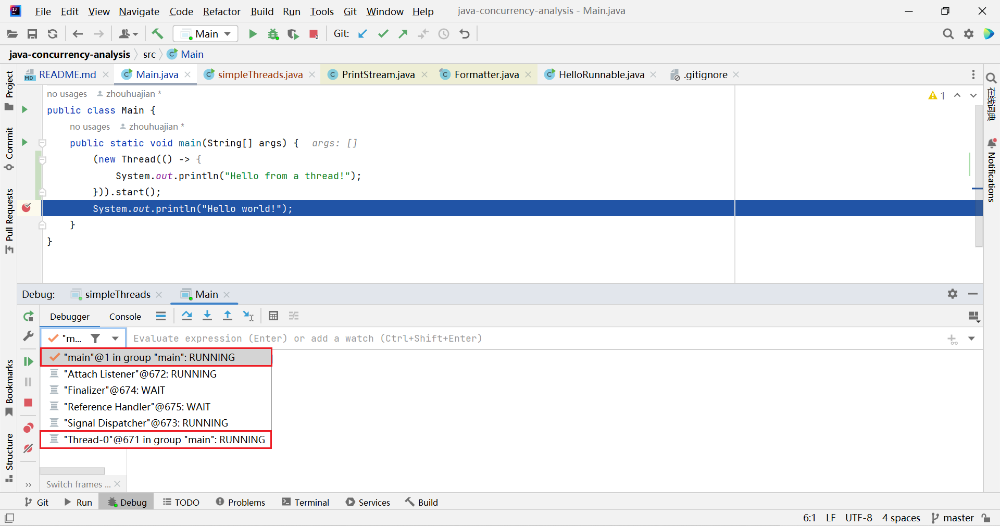

# Java 并发分析

## volatile 关键字

## AtomicInteger

atomic integer

## 进程与线程

1. 进程

一个进程有自己独立的运行环境，特别是，有自己的内存空间。

进程与进程之间可以相互通信，例如管道、套接字，不同系统间的进程也能进行通信。

2. 线程

每个Java程序一般都是一个进程，从代码的角度上看，每个进程至少有一个线程，叫做主线程。

但实际上，如果算上内存管理、信号处理等系统线程，每个Java进程至少有多个线程。

如果把线程分用户线程和系统线程，那么可以说每个进程至少有一个用户线程。



## 线程中断

有些方法发现线程已被中断，会抛出线程中断异常 例如Thread.sleep

线程也可以自己检查是否被中断了 Thread.interrupted() 对比 Thread.isInterrupted() 

Thread.interrupted()底层调用的是 currentThread().isInterrupted(true) clearInterrupted参数为true

在某些场景下clearInterrupted非常重要

## Synchronization

Threads communicate primarily by sharing access to fields and the objects reference fields refer to. This form of communication is extremely efficient, but makes two kinds of errors possible: thread interference(线程干扰) and memory consistency errors(内存一致性错误). The tool needed to prevent these errors is synchronization.

```text
synchronization
noun [ U ] (UK usually synchronisation)
UK  /ˌsɪŋ.krə.naɪˈzeɪ.ʃən/ US  /ˌsɪŋ.krə.nəˈzeɪ.ʃən/
 
the fact of happening at the same time, or the act of making things happen at the same time
同步；同步化
The words flash on a TV screen in synchronization with the music.
电视屏幕上的文字与音乐同步显示。
 
the act of making sure that watches or clocks show exactly the same time
（对多个钟表的）统一校准
The first step is synchronization of watches.
第一步是先给手表对时。
See
synchronize
```

The Java programming language provides two basic synchronization idioms: synchronized methods and synchronized statements.

```shell
# -v -verbose 输出附加信息
javap -v out/production/java-concurrency-analysis/synchronization/SynchronizedMethod.class 

Classfile /C:/Users/zhouh/Desktop/java-concurrency-analysis/out/production/java-concurrency-analysis/synchronization/SynchronizedMethod.class
  Last modified 2023年1月25日; size 375 bytes
  MD5 checksum de0b4fe1ba050de8c41bda1253d656d9
  Compiled from "SynchronizedMethod.java"
public class synchronization.SynchronizedMethod
  minor version: 0
  major version: 52
  flags: (0x0021) ACC_PUBLIC, ACC_SUPER
  this_class: #2                          // synchronization/SynchronizedMethod
  super_class: #3                         // java/lang/Object
  interfaces: 0, fields: 0, methods: 2, attributes: 1
Constant pool:
   #1 = Methodref          #3.#14         // java/lang/Object."<init>":()V
   #2 = Class              #15            // synchronization/SynchronizedMethod
   #3 = Class              #16            // java/lang/Object
   #4 = Utf8               <init>
   #5 = Utf8               ()V
   #6 = Utf8               Code
   #7 = Utf8               LineNumberTable
   #8 = Utf8               LocalVariableTable
   #9 = Utf8               this
  #10 = Utf8               Lsynchronization/SynchronizedMethod;
  #11 = Utf8               test
  #12 = Utf8               SourceFile
  #13 = Utf8               SynchronizedMethod.java
  #14 = NameAndType        #4:#5          // "<init>":()V
  #15 = Utf8               synchronization/SynchronizedMethod
  #16 = Utf8               java/lang/Object
{
  public synchronization.SynchronizedMethod();
    descriptor: ()V
    flags: (0x0001) ACC_PUBLIC
    Code:
      stack=1, locals=1, args_size=1
         0: aload_0
         1: invokespecial #1                  // Method java/lang/Object."<init>":()V
         4: return
      LineNumberTable:
        line 4: 0
      LocalVariableTable:
        Start  Length  Slot  Name   Signature
            0       5     0  this   Lsynchronization/SynchronizedMethod;

  synchronized void test();
    descriptor: ()V
    flags: (0x0020) ACC_SYNCHRONIZED
    Code:
      stack=0, locals=1, args_size=1
         0: return
      LineNumberTable:
        line 7: 0
      LocalVariableTable:
        Start  Length  Slot  Name   Signature
            0       1     0  this   Lsynchronization/SynchronizedMethod;
}
SourceFile: "SynchronizedMethod.java"
```

```shell
javap -v out/production/java-concurrency-analysis/synchronization/SynchronizedStatement.class

Classfile /C:/Users/zhouh/Desktop/java-concurrency-analysis/out/production/java-concurrency-analysis/synchronization/SynchronizedStatement.class
  Last modified 2023年1月25日; size 496 bytes
  MD5 checksum 91e614e71096730ad418be963f4ed0de
  Compiled from "SynchronizedStatement.java"
public class synchronization.SynchronizedStatement
  minor version: 0
  major version: 52
  flags: (0x0021) ACC_PUBLIC, ACC_SUPER
  this_class: #2                          // synchronization/SynchronizedStatement
  super_class: #3                         // java/lang/Object
  interfaces: 0, fields: 0, methods: 2, attributes: 1
Constant pool:
   #1 = Methodref          #3.#18         // java/lang/Object."<init>":()V
   #2 = Class              #19            // synchronization/SynchronizedStatement
   #3 = Class              #20            // java/lang/Object
   #4 = Utf8               <init>
   #5 = Utf8               ()V
   #6 = Utf8               Code
   #7 = Utf8               LineNumberTable
   #8 = Utf8               LocalVariableTable
   #9 = Utf8               this
  #10 = Utf8               Lsynchronization/SynchronizedStatement;
  #11 = Utf8               test
  #12 = Utf8               StackMapTable
  #13 = Class              #19            // synchronization/SynchronizedStatement
  #14 = Class              #20            // java/lang/Object
  #15 = Class              #21            // java/lang/Throwable
  #16 = Utf8               SourceFile
  #17 = Utf8               SynchronizedStatement.java
  #18 = NameAndType        #4:#5          // "<init>":()V
  #19 = Utf8               synchronization/SynchronizedStatement
  #20 = Utf8               java/lang/Object
  #21 = Utf8               java/lang/Throwable
{
  public synchronization.SynchronizedStatement();
    descriptor: ()V
    flags: (0x0001) ACC_PUBLIC
    Code:
      stack=1, locals=1, args_size=1
         0: aload_0
         1: invokespecial #1                  // Method java/lang/Object."<init>":()V
         4: return
      LineNumberTable:
        line 4: 0
      LocalVariableTable:
        Start  Length  Slot  Name   Signature
            0       5     0  this   Lsynchronization/SynchronizedStatement;

  void test();
    descriptor: ()V
    flags: (0x0000)
    Code:
      stack=2, locals=3, args_size=1
         0: aload_0
         1: dup
         2: astore_1
         3: monitorenter
         4: aload_1
         5: monitorexit
         6: goto          14
         9: astore_2
        10: aload_1
        11: monitorexit
        12: aload_2
        13: athrow
        14: return
      Exception table:
         from    to  target type
             4     6     9   any
             9    12     9   any
      LineNumberTable:
        line 6: 0
        line 8: 4
        line 9: 14
      LocalVariableTable:
        Start  Length  Slot  Name   Signature
            0      15     0  this   Lsynchronization/SynchronizedStatement;
      StackMapTable: number_of_entries = 2
        frame_type = 255 /* full_frame */
          offset_delta = 9
          locals = [ class synchronization/SynchronizedStatement, class java/lang/Object ]
          stack = [ class java/lang/Throwable ]
        frame_type = 250 /* chop */
          offset_delta = 4
}
SourceFile: "SynchronizedStatement.java"

```